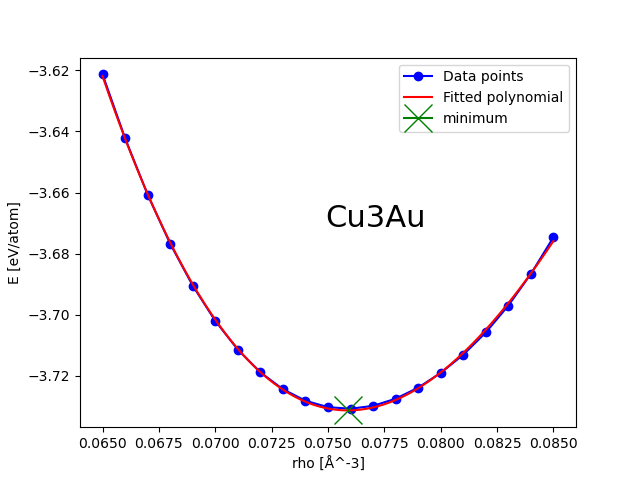
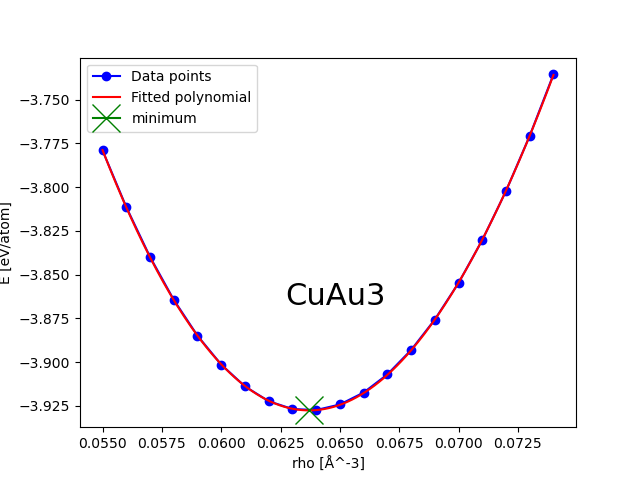

# 'Science tests' for gamdpy

These are tests that might take 10's of minutes to carefully test that gamdpy is producing results consistent with reference data - in most cases from published papers.

## Kob & Andersen Binary LJ mixture, 
PRL v129 245501 (2022), doi.org/10.1103/PhysRevLett.129.245501

## SLLOD LJ viscosity, 
PRA v44 6936 (1991), doi.org/10.1103/PhysRevA.44.6936

## EAM mixing enthalpy for Cu-Au alloys
Gola and Pastewka, Modelling Simul. Mater. Sci. Eng. 26 055006 (2018), https://doi.org/10.1088/1361-651X/aabce4

## EAM direct comparison with LAMMPS (pure Cu)

