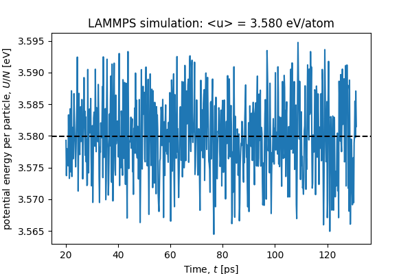
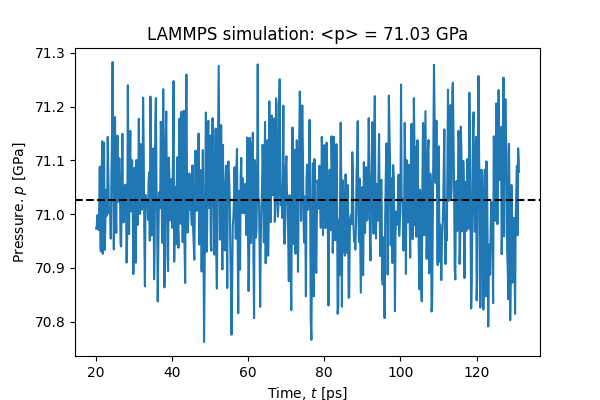
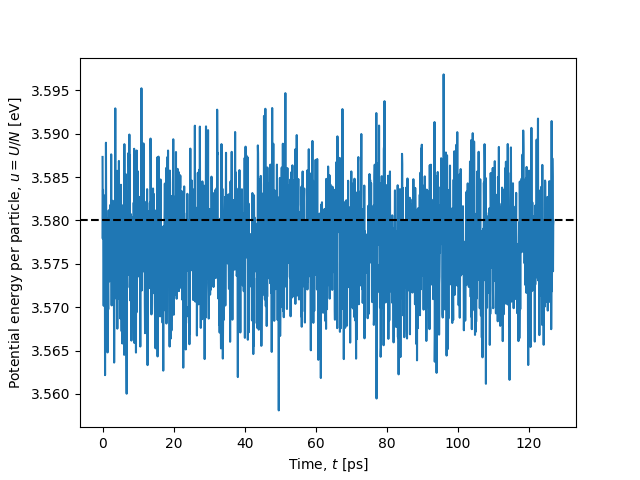
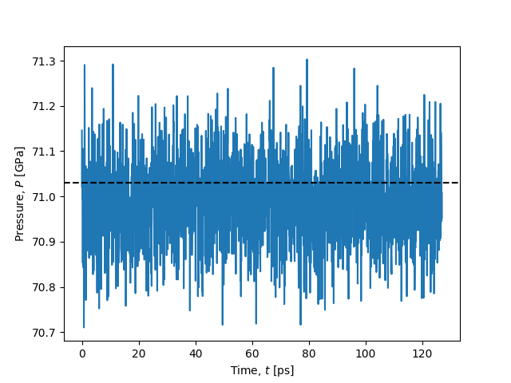
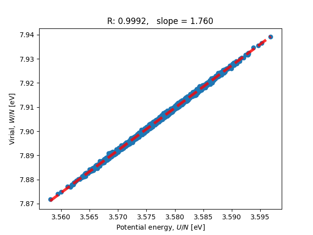
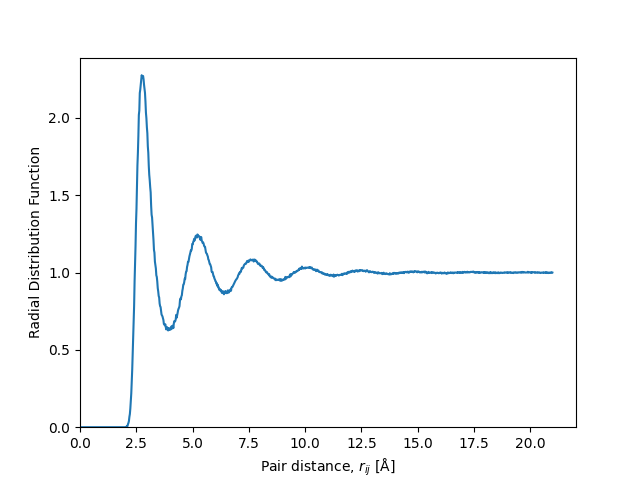
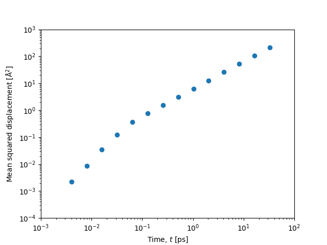

# Investigation of ZBL potential

A comparison between a LAMMPS simulation and a gamdpy simulation of Cobber (Z=29)
using the universal ZBL potential.
The initial structure is an FCC lattice with lattice constant of 4.2 Å.
An NVT simulation is done at T = 3500 K, where the crystal melts.
The figures below show results of liquid state points 
(discarding the first part of the simulation).

## Results

### LAMMPS

### Gamdpy

A comparison between codebase illustrations and daily scientific test results to ensure correctness. Due to a chaotic behavior, the illustrations differ slightly for each run. The scientific tests are scheduled to run nightly at 2:00.

<h3>Energy Comparison</h3>
<table>
  <tr>
    <td></td>
    <td></td>
  </tr>
</table>

<h3>Pressure Comparison</h3>
<table>
  <tr>
    <td></td>
    <td></td>
  </tr>
</table>

<h3>UW Comparison</h3>
<table>
  <tr>
    <td></td>
    <td></td>
  </tr>
</table>

<h3>RDF Comparison</h3>
<table>
  <tr>
    <td></td>
    <td></td>
  </tr>
</table>

<h3>MSD Comparison</h3>
<table>
  <tr>
    <td></td>
    <td></td>
  </tr>
</table>

## Run simulations and analysis

### LAMMPS simulation

Input files for LAMMPS are located in `Data_lammps`

    cd Data_lammps

Run the simulation with (single core)

    lmp -in in.lammps -log log.lammps

or (multi-core)

    mpirun -np 8 lmp -in in.lammps -log log.lammps

Inspect data and generate figures with

    python inspect_data.py

### Run simulation and analysis

    python zbl.py | tee zbl.log
    python analyse.py | tee analyse.log

### Clean

    rm zbl.h5

